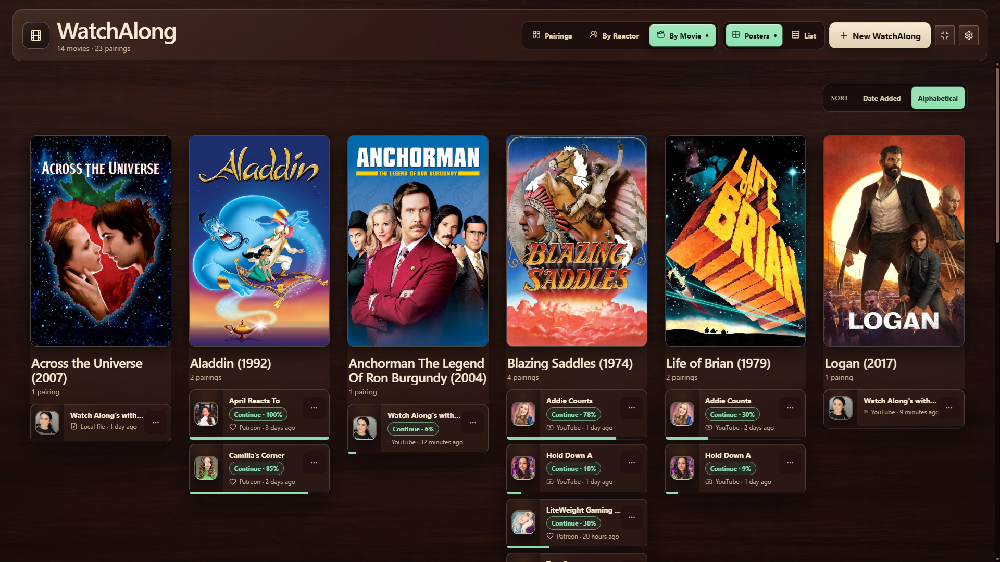
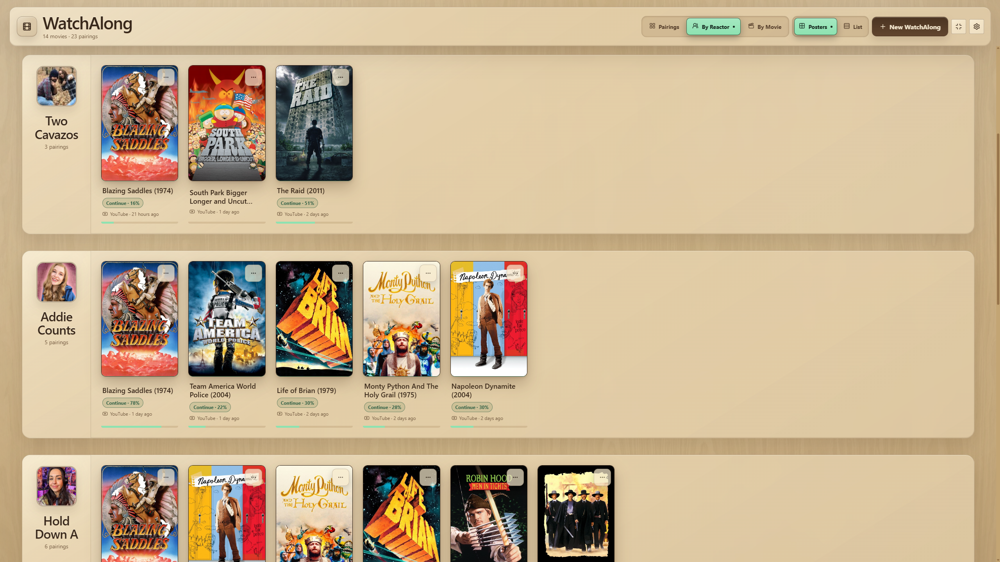

# WatchAlong

**You own the movie. You support the content creator. Let WatchAlong handle the rest.**

We all know the pain. You support your favorite YouTube reactor on Patreon, and you want to watch a full-length reaction alongside the movie, so you line up the starting point as carefully as you can, then at some point you have to pause two separate media players at the exact same time, and even if you nail that, your reactor might be in Europe with a PAL copy that runs just a little faster than your NTSC file, so by the halfway mark everything has drifted apart anyways and you're back to square one. It can make the whole membership feel like more trouble than it's worth.

That's why I built WatchAlong. Not to replace my Patreon subscriptions, to make them worth keeping.

You've already done the important part. Now point WatchAlong at your local movie file, add a link to the reaction, then go make your popcorn. WatchAlong downloads the reaction, scans both videos, automatically finds the sync point, measures any drift, and keeps both videos locked together through pauses, seeks, and restarts.

Your Patreon subscriptions are what actually matter. The sync setup shouldn't be what gets in the way of enjoying the content you paid for.



## What WatchAlong does

- **Finds the sync for you.** WatchAlong looks at the reaction, finds the movie inside it, and lines everything up automatically. No countdown. No nudging.
- **Fixes frame-rate drift automatically.** Your movie and the creator's copy might run at slightly different speeds. Over two hours, that gap becomes seconds. WatchAlong measures the difference and corrects it.
- **Keeps both videos locked.** Pause, seek, change the playback speed. Both videos move together.
- **Picture-in-picture or pop-out.** Watch the reaction with your movie in a draggable, resizable overlay. Or pop the movie out to a second screen.
- **Download reactions directly.** Paste a Patreon post URL, an unlisted YouTube link, or add a local file. WatchAlong grabs the full-length reaction for you.
- **Your library, remembered.** Every pairing is saved. Sync, playback position, PiP layout. Close the app, come back tomorrow night, and everything is right where you left it. Browse by movie, by reactor, or by pairing.
- **Subtitles.** Load SRT or VTT files. They display over the movie.
- **Audio track selection.** Watching a foreign film? Choose between the original language and the dub right from the player. Supports multi-track MKV files.
- **Playback controls that follow you.** Spacebar, earbud taps, and system media keys control both videos. Arrow keys skip. Full list in the [FAQ](FAQ.md).

## Our principles

- **Creators get paid.** Full-length reactions live behind a Patreon subscription. WatchAlong doesn't bypass that. You need an active subscription to download. Everyone using this app is already supporting the creator, and the easier it is to watch their content, the more reason to keep subscribing.
- **You own your media.** The app works with DRM-free local files you're authorized to use. No streaming service in the middle. No license that can expire.
- **Everything stays local.** Your library, sessions, downloads, and settings stay on your drive. No telemetry. No analytics. No account. No server. The only network requests are the ones you trigger.
- **Free and open source.** MIT license. No paid features, no ads, no data sale. Now and always.

## Getting started

1. Have a DRM-free local movie file you're authorized to use.
2. Download WatchAlong from the [releases page](https://github.com/nizzyG/WatchAlong/releases).
   - **Windows:** Run the `.exe` installer.
   - **macOS:** Open the `.dmg` and drag to Applications.
3. Launch and click **+ New WatchAlong**.
4. Follow the wizard to load your movie and add a reaction.

## How auto-sync works (and when it asks for help)

WatchAlong looks at the reaction, finds the movie inside it, and matches several moments across the runtime. From those matches, it calculates both the sync point and the frame-rate drift in one pass.

The engine is confident on most pairings. When it isn't, it says so and steps aside. You get the manual sync screen, line up the countdown yourself, and set the frame rate by hand. No guess is ever applied silently. A sync tool that confidently lines you up wrong is worse than one that asks you to do it yourself.

## Appearance

WatchAlong has two cabinet modes: **Mahogany** (dark) and **Oak** (light). Both are warm, textured, and built to feel like real furniture, not a generic app theme. The app follows your system's dark or light preference by default. Switch manually from the Command Panel.



Movie poster art appears automatically when your library folders contain standard image files (`poster.jpg`, `folder.jpg`, or the movie filename with a `.jpg` extension), the same conventions used by Kodi, Jellyfin, and other media tools. WatchAlong reads what you already have. It never fetches images from the internet.

## Platform notes

**Windows:** Tested end to end.

**macOS:** Built and verified, but tested in a virtual machine rather than on real Apple hardware. If you run into trouble on a real Mac, [open an issue](https://github.com/nizzyG/WatchAlong/issues) and let me know.

This release was built by one person. Bug reports and feedback are always welcome.

## FAQ

Questions about legality, file formats, Patreon setup, frame-rate drift, or how auto-sync decides what it can handle? See the [FAQ page](FAQ.md).

## Legal and privacy

- [Disclaimer](DISCLAIMER.md)
- [Privacy](PRIVACY.md)
- [Security](SECURITY.md)
- [Third-Party Notices](THIRD_PARTY_NOTICES.md)
- [Bundled Tool Provenance](TOOL_PROVENANCE.md)

## Support

WatchAlong is free and always will be. The best way to support it: keep supporting the creators whose reactions you watch. That's what the app is for.

If you'd like to support the developer directly, you can [buy me a coffee on Ko-fi](https://ko-fi.com/watchalong).

## For developers

Electron, React, and TypeScript. The sync engine and auto-sync detection are pure, tested TypeScript modules. The bundled tools (yt-dlp, ffmpeg, patreon-dl, Node.js) have their own licenses. See [THIRD_PARTY_NOTICES.md](THIRD_PARTY_NOTICES.md). Exact sources and SHA-256 digests for the standalone executables are recorded in [TOOL_PROVENANCE.md](TOOL_PROVENANCE.md) and checked offline before every build.

```bash
git clone https://github.com/nizzyG/WatchAlong.git
cd WatchAlong
npm install
npm run dev
```

### Verifying your download

Installers aren't code-signed yet. Each release ships a `SHA256SUMS.txt` generated by CI so you can verify your download against the originals. Download the checksum file alongside your installer, then:

**Windows (PowerShell):**

```powershell
$installer = Get-ChildItem -File 'WatchAlong-v*-windows-x64.exe'
if (@($installer).Count -ne 1) { throw 'Expected exactly one WatchAlong Windows installer.' }
$line = Get-Content .\SHA256SUMS.txt | Where-Object { $_.EndsWith("  $($installer.Name)") }
if (-not $line) { throw 'Installer is not listed in SHA256SUMS.txt.' }
$expected = ($line -split '\s+', 2)[0]
$actual = (Get-FileHash -Algorithm SHA256 -LiteralPath $installer.FullName).Hash.ToLowerInvariant()
if ($actual -ne $expected) { throw 'Checksum mismatch. Do not run this installer.' }
"Checksum verified: $($installer.Name)"
```

**macOS (Terminal):**

```bash
installer=$(find . -maxdepth 1 -type f -name 'WatchAlong-v*-macos-*.dmg' -print)
count=$(printf '%s\n' "$installer" | sed '/^$/d' | wc -l | tr -d ' ')
test "$count" -eq 1 || { echo "Expected exactly one WatchAlong macOS installer" >&2; exit 1; }
grep -F "  ${installer#./}" SHA256SUMS.txt | shasum -a 256 -c -
```

A successful check prints the installer name followed by `OK`. A mismatch means delete the file and [open an issue](https://github.com/nizzyG/WatchAlong/issues) rather than opening it.

MIT license.
