# 🎬 Syncing Your First WatchAlong: A Step-by-Step Tutorial

Welcome to **WatchAlong**! We are so glad you're here. We believe that if you already own your movie and you are supporting your favorite reactors on Patreon, watching them together should be effortless. This tutorial will walk you through setting up your very first synced watchalong.

For this guide, we will walk through pairing a legally owned local copy of **X-Men: First Class** with **Shanelle Riccio's** brilliant full-length watchalong from her Patreon (who we proudly support as active Patrons, as we patiently wait for her to get to **Logan**).

Don't worry—there are no command lines, no complicated setups, and absolutely no technical headaches. Just follow these steps, and you'll be set up in no time!

## 📋 What You'll Need Before We Start

1. **Your movie file**: A DRM-free copy of *X-Men: First Class (2011)* on your computer.
2. **A Patreon Subscription**: An active subscription to [Shanelle Riccio's Patreon](https://www.patreon.com/cw/shanellericcio) (or whichever creator you are watching).
3. **The WatchAlong App**: Download the latest release for your operating system from the [releases page](https://github.com/nizzyG/WatchAlong/releases).

## 🚀 Step 1: Open WatchAlong and Start a New Session

When you first open WatchAlong, you'll see your **Library**. This is where all of your saved watchalongs will live so you can jump right back in later.

To begin, click the big **+ New WatchAlong** button.

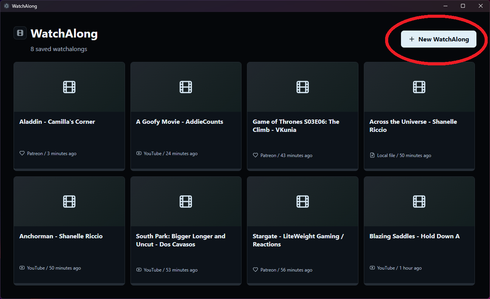

## 🎬 Step 2: Choose Your Local Movie File

WatchAlong will open a file browser. Navigate to where you keep your movie files and select your copy of *X-Men: First Class*.

Once selected, the wizard will display a green checkmark next to your movie file. Now, it's time to add the reaction!

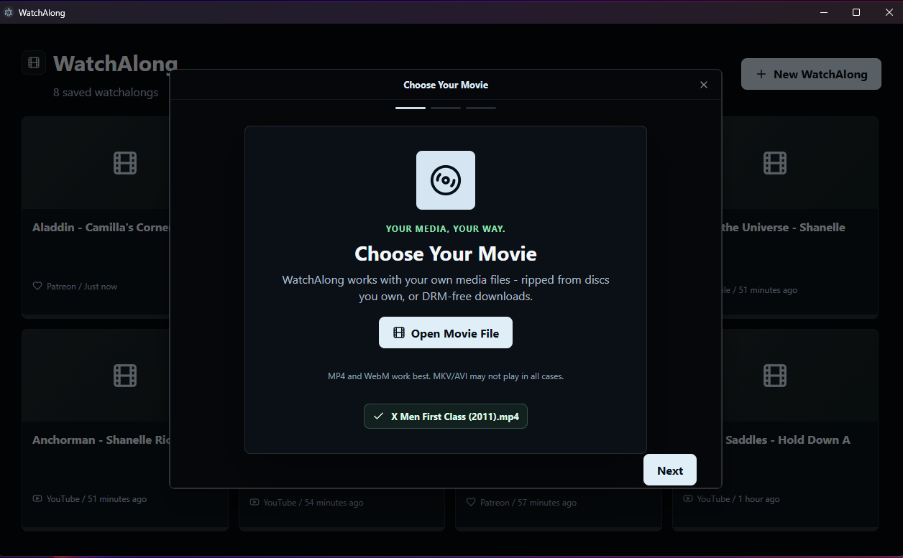

## 🔗 Step 3: Copy the Patreon Post URL

Now, open your web browser (like Firefox or Chrome), go to Patreon, and navigate to Shanelle Riccio's post for the *X-Men: First Class Watch Along*.

Simply copy the full URL from your browser's address bar. 

> [NOTE]
> **Is it safe to copy the link?**
> Absolutely. WatchAlong only uses this link to request the video directly from Patreon's servers on your behalf. Your data is kept entirely local on your machine, and only people with an **ACTIVE subscription** to Shanelle's Patreon can download the video.

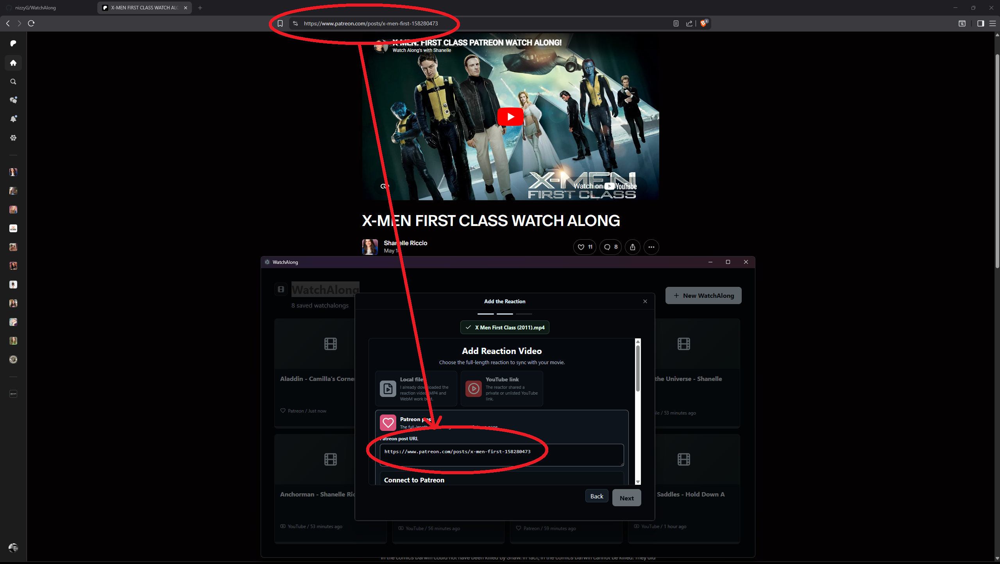

## 📋 Step 4: Paste the Patreon Link into WatchAlong

Go back to the WatchAlong window, click on the **Patreon post** option card to expand it, and paste your copied URL into the text area.

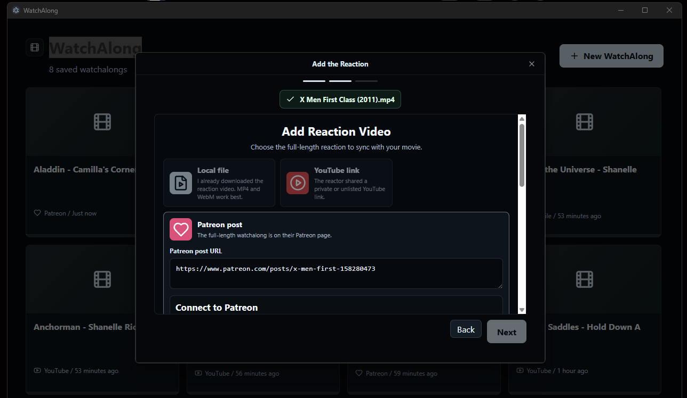

## 🔒 Step 5: Connect to Patreon

After pasting the link, WatchAlong will show the **Connect to Patreon** options. Since Patreon videos are behind a subscription tier, the app needs to authenticate that you are an active supporter.

1. WatchAlong will detect the browsers installed on your computer.
2. We highly recommend using **Firefox** because it allows WatchAlong to automatically and securely read your session cookie in one click.
3. Click the **Firefox** button to connect.

> [!TIP]
> **Other Browsers & Fallback:**
> If you don't use Firefox or if browser security prevents automatic extraction, don't worry! WatchAlong provides an easy secure sign-in window, or you can follow the simple instructions shown in the app to copy and paste your `session_id` cookie manually.

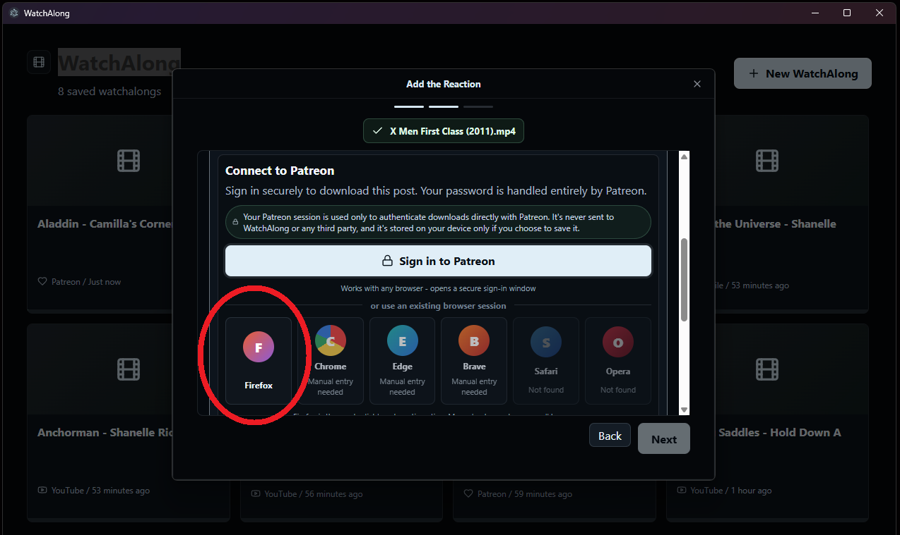

## 📥 Step 6: Download the Reaction

Once connected, WatchAlong will verify your access and begin downloading the reaction video. 

You'll see a progress bar showing the download speed and estimated time. Sit back and relax while the app handles the download!

_(Please be patient. These are large video files and can take longer than you expect to download.)_

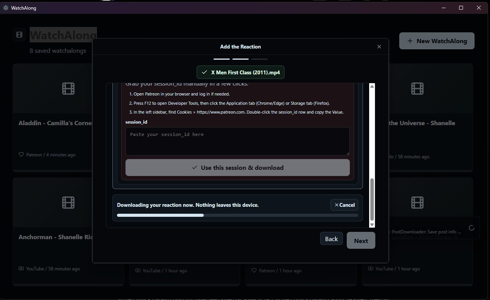

## 🎉 Step 7: Ready to Sync!

Once the download finishes, the wizard will show green checkmarks for both the movie and the reaction. 

You are now ready to lock them together! Click **Sync Now** to enter the synchronization screen.

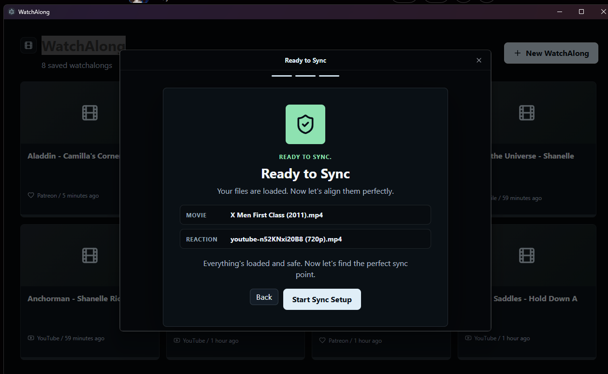

## ⏱️ Step 8: The Sync Setup Screen

The synchronization screen will open with both the movie and the reaction paused.

- The **Movie Frame** (on the right) will start at `0:00:00`. Leave it there!
- The **Reaction Frame** (on the left) will also be paused.
- Click **Play** on the **Reaction Frame** to let Shanelle's intro play. 

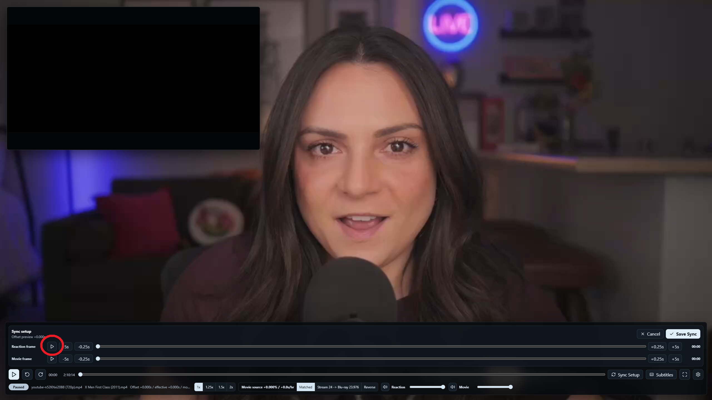

## 🎯 Step 9: Save the Sync Point

Listen to Shanelle's intro. Reactors almost always do a countdown (e.g., *"3... 2... 1... Play!"*) to tell their viewers when to start the movie.

1. Keep your cursor over the **Save Sync** button.
2. Watch and listen to Shanelle. At the exact moment she finishes her countdown and presses play on her movie, click **Save Sync** (or press Enter).

This tells WatchAlong exactly how the two videos align!

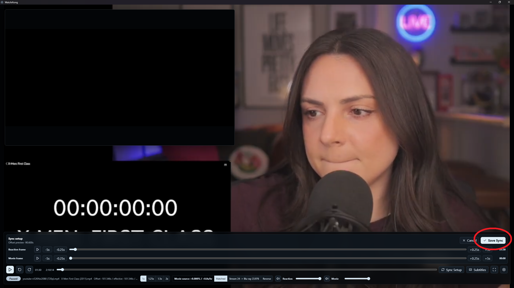

## 🍿 Step 10: Lean Back and Enjoy!

Congratulations! Your movie and reaction are now perfectly, frame-accurately synced. 

You can watch the reaction in a Picture-in-Picture window over the movie, or even pop the movie out into its own window if you have multiple monitors.

Feel free to pause, skip back if you missed a funny moment, or close the app and come back tomorrow. WatchAlong keeps everything locked in place so you never have to sync it again!

Pro-tip: use the `[` and `]` keys to nudge the sync offset during the first minute to ensure the perfect sync!

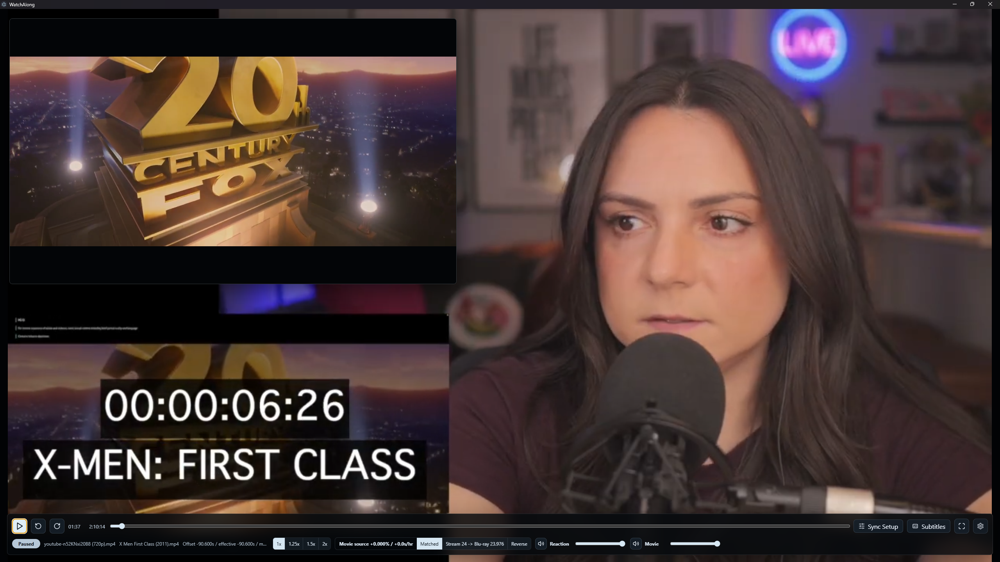

---

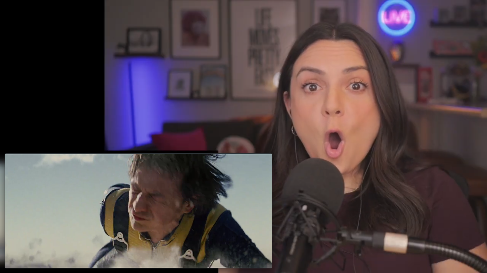

## ⌨️ Useful Keyboard Shortcuts

While watching, you can control everything using these handy shortcuts:

| Shortcut | Action |
| :--- | :--- |
| `Space` | Play / Pause both videos simultaneously |
| `←` / `→` | Seek backward / forward 5 seconds |
| `R` | Mute / Unmute the reactor's audio |
| `M` | Mute / Unmute the movie's audio |
| `P` | Toggle Picture-in-Picture window visibility |
| `[` / `]` | Nudge the sync offset by -0.1s / +0.1s (perfect for fine-tuning) |
| `Ctrl+Shift+P` | Open the Command Panel |

Thank you for supporting your favorite content creators and owning your media. Enjoy your WatchAlong night! 🎬🍿

---

❓ [FAQ](https://github.com/nizzyG/WatchAlong/blob/main/FAQ.md)
🐛 [Report a Bug](https://github.com/nizzyG/WatchAlong/issues)
☕ [Buy the Dev a Coffee](https://ko-fi.com/watchalong)