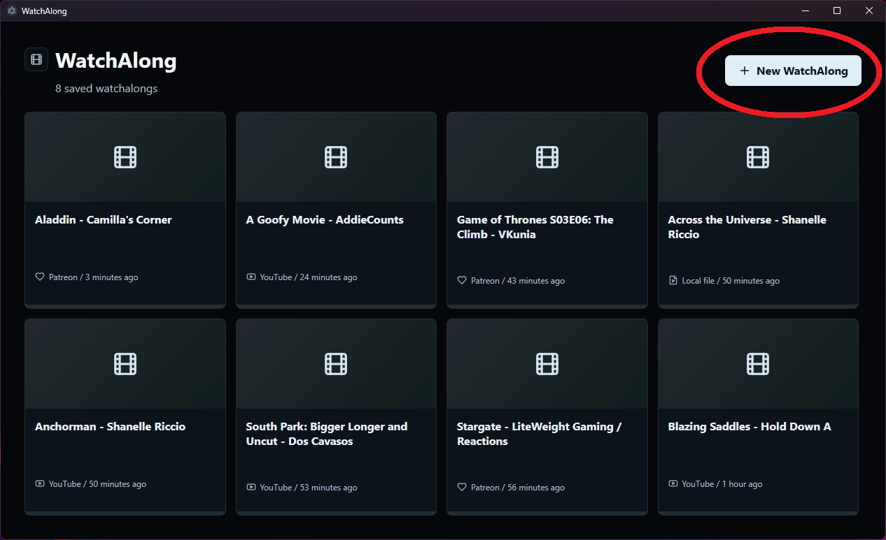
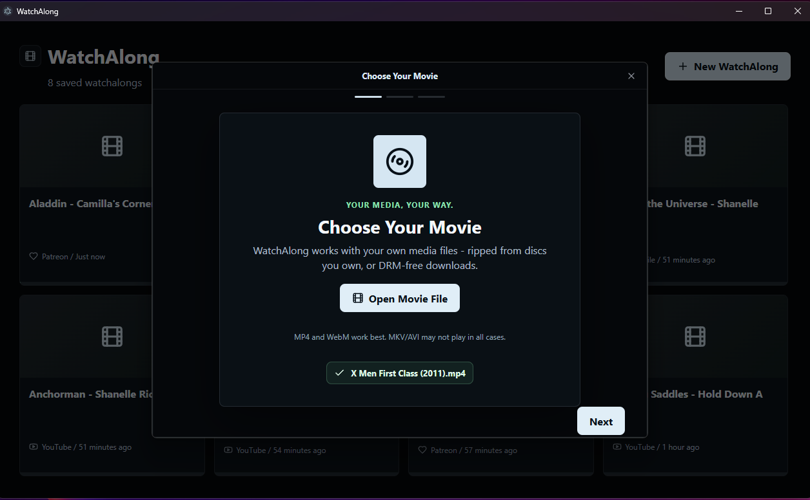
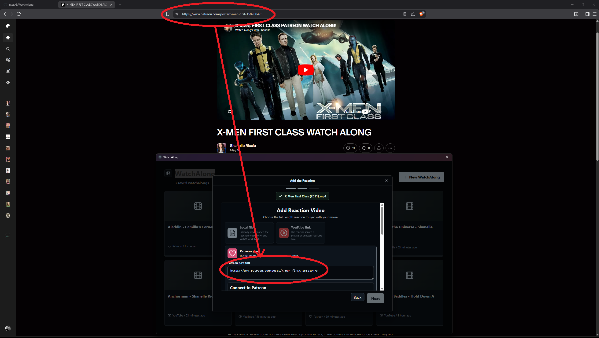
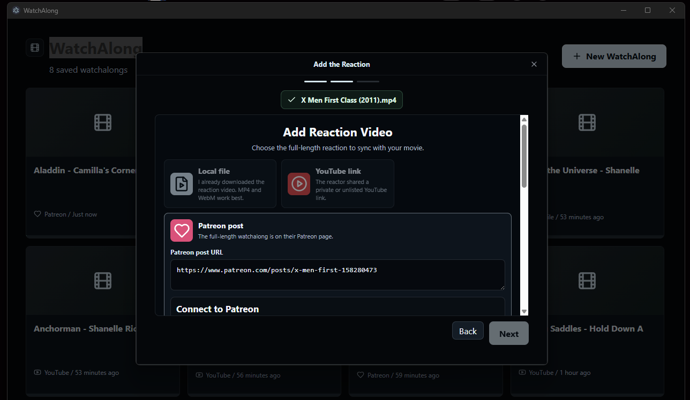
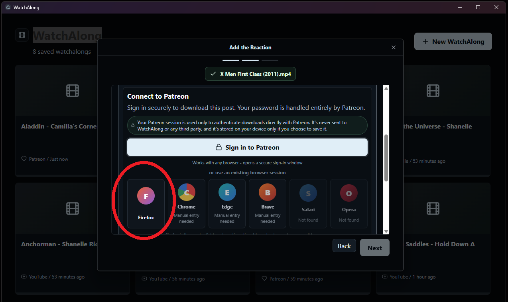
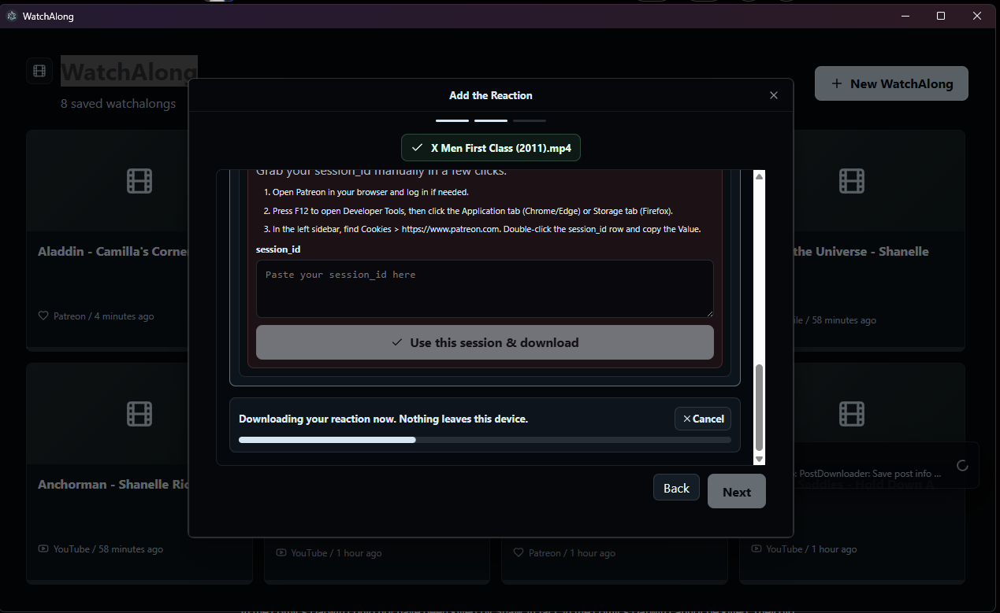
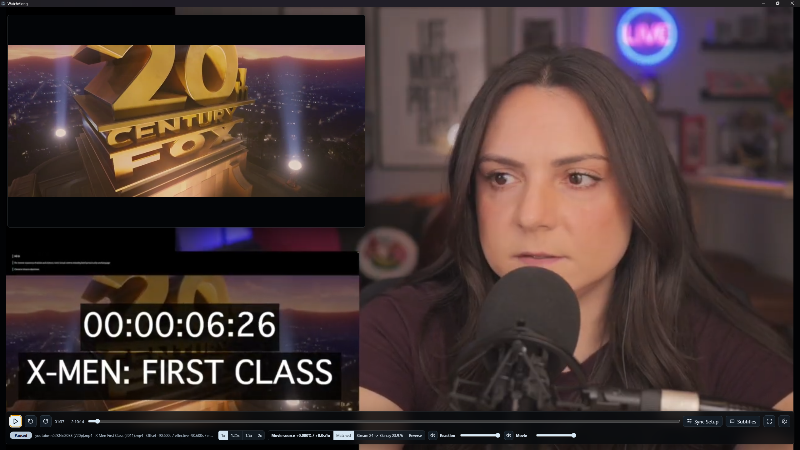

# Syncing Your First WatchAlong

You own the movie. You support the creator. This guide gets you watching in minutes.

We'll pair a local copy of **X-Men: First Class** with **Shanelle Riccio's** full-length watch-along from her Patreon. (Shanelle has given her permission for WatchAlong to use her name and likeness — she's one of the creators who wants this tool to exist.)

No command lines. No technical setup. Just follow these steps.

## What you'll need

1. **Your movie file** — a DRM-free local copy of the movie you're authorized to use.
2. **A Patreon subscription** — an active subscription to the reactor whose reaction you want to watch.
3. **The WatchAlong app** — download the latest release for your operating system from the [releases page](https://github.com/nizzyG/WatchAlong/releases).

## Step 1 — Start a new WatchAlong

When you first open WatchAlong, you'll see your **Library**. This is where all your saved pairings live so you can jump back in anytime.

Click **+ New WatchAlong** to begin.

## Step 2 — Choose your movie file

WatchAlong opens a file browser. Navigate to your movie file and select it.

Once selected, the wizard shows a green checkmark next to your movie. Time to add the reaction.

## Step 3 — Copy the Patreon post URL

Open your web browser, go to Patreon, and navigate to the reactor's post for the watch-along you want. Copy the full URL from your browser's address bar.

> **Is it safe to copy the link?**
> Yes. WatchAlong uses this link to request the video from Patreon on your behalf, using your Patreon session for authentication. Only people with an active subscription can download. Your session is never sent to any WatchAlong-operated server. See the [Security](SECURITY.md) page for the full details.

## Step 4 — Paste the link into WatchAlong

Go back to the WatchAlong window, click the **Patreon post** option to expand it, and paste your URL into the text area.

## Step 5 — Connect to Patreon

Patreon videos live behind a subscription tier. WatchAlong needs to verify you're an active supporter.

1. WatchAlong detects the browsers installed on your computer.
2. **Firefox** is recommended — it lets WatchAlong read your session cookie automatically in one click.
3. Click **Firefox** to connect.

> **Don't use Firefox?**
> If browser security prevents automatic extraction, WatchAlong provides a secure in-app sign-in window. You can also follow the in-app instructions to copy and paste your `session_id` cookie manually. It takes about thirty seconds.

## Step 6 — WatchAlong does the rest

Once connected, WatchAlong downloads the reaction video, then automatically finds the sync point and measures any frame-rate drift. You'll see a progress indicator while it works — this is one continuous motion, not separate steps you have to manage.

When it finishes, both videos open in the player, already locked together. Start watching.

That's it. The app found the sync. You're watching.

## If auto-sync can't find it

Sometimes a reaction's movie inset is too small, too obscured, or too pixelated for the engine to match confidently. When that happens, WatchAlong says so and drops you into the manual sync screen. Here's how that works:

1. Both videos open paused. The movie starts at `0:00:00`. Leave it there.
2. Press **Play** on the reaction. Listen for the reactor's countdown.
3. At the exact moment the countdown ends and the reactor presses play, click **Save Sync** (or press Enter).
4. Use the `[` and `]` keys to nudge the offset by 0.1 seconds if the first minute feels slightly off.

You only do this once per pairing. After that, the sync holds through pauses, seeks, and restarts.

The manual sync screen also has the frame-rate selector if you need to correct for drift yourself. See the [FAQ](FAQ.md) for the details on each option.

## Lean back and enjoy

Your movie and reaction are synced. WatchAlong corrects drift continuously and invisibly.

Watch the reaction in a picture-in-picture window over the movie. Prefer a second screen? Pop the movie out into its own window. Pause, skip back, close the app and come back tomorrow — everything stays locked.

## Keyboard shortcuts

| Shortcut | Action |
| :--- | :--- |
| `Space` | Play or pause both videos |
| `←` / `→` | Seek backward or forward 5 seconds |
| `R` | Mute or unmute the reaction |
| `M` | Mute or unmute the movie |
| `P` | Toggle picture-in-picture visibility |
| `[` / `]` | Nudge the sync offset by −0.1s / +0.1s |
| `Ctrl+Shift+P` | Open the Command Panel |

Thank you for supporting your favorite creators and owning your media. Enjoy the watch.

---

❓ [FAQ](https://github.com/nizzyG/WatchAlong/blob/main/FAQ.md)
⚖️ [Disclaimer](https://github.com/nizzyG/WatchAlong/blob/main/DISCLAIMER.md)
🔒 [Privacy & Security](https://github.com/nizzyG/WatchAlong/blob/main/SECURITY.md)
🐛 [Report a Bug](https://github.com/nizzyG/WatchAlong/issues)
☕ [Support the Dev on Ko-fi](https://ko-fi.com/watchalong)
